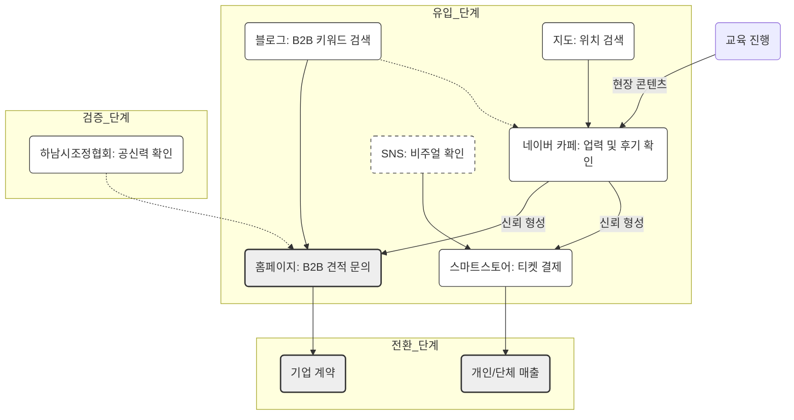

로잉프로(Rowing Pro) 2026 디지털 마케팅 전략
**작성일:** 2026년 1월 25일
**수신:** 로잉프로 신임 대표이사 및 임직원

---

## Slide 1. 요약 (Executive Summary)
### ■ 기업 정체성 (Identity)
*   **사업영역:** 조정(Rowing) 기반의 B2C 레슨 및 B2B 기업 교육 서비스
*   **핵심역량:** 대한민국 국가대표 출신 인적 자원, 13년(2013~)의 사업 업력
*   **대외신뢰:** 하남시조정협회 공식 주관사 자격 보유

### ■ 2026 운영 목표
*   **채널 통합:** 분산된 디지털 자산(카페, 블로그, 협회, 홈페이지)의 유기적 연결
*   **타겟 전환:** 시설 중심 홍보에서 **'인적 전문성(국가대표)'** 및 **'프로그램(팀빌딩)'** 중심으로 전환
*   **수익 구조:** 온라인 채널 유입(Traffic)을 실제 결제(Sales)로 전환하는 파이프라인 구축

---

## Slide 2. 네이버 채널 운영의 당위성
### ■ 시장 구조 분석
*   **검색 점유율:** 국내 로컬(지역 기반) 및 목적형(워크샵, 교육) 검색의 90%가 네이버에서 발생.
*   **플랫폼 특징:** [검색(블로그)] → [검증(카페)] → [위치(지도)] → [결제(예약)]가 단일 플랫폼 내에서 완결됨.
*   **타겟 행동:** 기업 B2B 담당자는 인스타그램이 아닌 포털 검색을 통해 기획안 소스를 수집함.
*   **결론:** **네이버 생태계 장악 없이 국내 로컬/교육 비즈니스 확장은 불가능함.**

---

## Slide 3. 보유 자산 총괄 진단 (Total Asset Audit)
### ■ 1. 디지털 플랫폼 (Digital Channels)
*   **네이버 카페:** [로잉스토리] (2013년 개설 / 회원 및 13년치 데이터 보유 / 핵심 커뮤니티)
*   **네이버 블로그:** [ID: saudademaio] (2013년 개설 / 활동 이력 보유로 최적화 상태 / 즉시 활용 가능)
*   **웹사이트:** [Rowing Pro] (B2B 영업 거점), [하남시조정협회] (공신력 확보)
*   **스마트스토어:** 결제 및 티켓팅 시스템 완비

### ■ 2. 무형 자산 (Intangible Assets)
*   **업력(History):** 2013년 '지오캐치'부터 이어진 13년의 사업 지속성 (경쟁사 진입 장벽)
*   **실적(Track Record):** 삼성, ADT캡스 등 대기업 교육 이력 (2015년 보고서 근거)

### ■ 3. 인적 자원 (Human Resources)
*   **전문성:** **[대한민국 조정 국가대표 출신]** 대표 및 코치진 (핵심 차별화 요소)

---

## Slide 4. [Channel 1] 네이버 카페 (로잉스토리)
### ■ 역할: 기존 고객 유지(Retention) 및 데이터 아카이브
*   **운영 방향:** 신규 유입보다는 전문성 증빙 및 회원 락인(Lock-in) 목적
*   **실행 과제:**
    1.  **자료 복원:** 2013~2015년(지오캐치) 사업 실적 및 사진 자료 [History] 게시판 업로드.
    2.  **답변 전문화:** Q&A 답변 시 작성자를 **'前 국가대표 OOO 코치'**로 명기하여 신뢰도 제고.
    3.  **접근성 확대:** [기업 교육 후기], [전문 칼럼] 게시판을 전체 공개로 전환하여 검색 노출 유도.

---

## Slide 5. [Channel 2] 네이버 블로그 (saudademaio)
### ■ 역할: B2B 리드(Lead) 확보 및 유입 창구
*   **운영 방향:** 기업 담당자 타겟의 정보성 콘텐츠 게시 (일기 형식 지양)
*   **실행 과제:**
    1.  **계정 활용:** 신규 개설 없이 기존 계정(saudademaio) 사용 (검색 노출 유리).
    2.  **리브랜딩:** 블로그명을 **[로잉프로 | 국가대표가 지도하는 기업교육]**으로 변경.
    3.  **필수 콘텐츠(4종) 게시:**
        *   회사 소개 (국가대표 강사진, 협회 주관사)
        *   기업 팀빌딩 커리큘럼 (제안서 요약)
        *   주요 진행 사례 (레퍼런스)
        *   시설 및 위치 안내

---

## Slide 6. [Channel 3] 홈페이지 (Rowing Pro)
### ■ 역할: 최종 신뢰 확인 및 문의 접수
*   **운영 방향:** 신임 대표이사 취임에 맞춰 브랜드 메시지 재정립 및 B2B 제안서 기능 수행
*   **개편 포인트:**
    1.  **메시지:** **"국가대표가 직접 설계한 기업 팀빌딩"** (전문성 강조).
    2.  **비주얼:** 대표 및 코치진의 프로필(선수 시절/현재)을 메인 상단에 배치.
    3.  **기능:** 제안서 다운로드 시 고객 정보(DB) 수집 기능 구현.
    4.  **연동:** 메인 화면에 **[하남시조정협회 주관사]** 배너 및 **[카페 바로가기]** 링크 삽입.

---

## Slide 7. [Channel 4] 스마트스토어 & SNS
### ■ 역할: 결제 편의성 제공 및 시각적 홍보
*   **스마트스토어:**
    *   **용도:** 서비스(체험권, 상담권) 결제 창구.
    *   **과제:** 상품명을 검색 키워드([하남 워크샵], [조정 체험]) 기반으로 수정, 상세페이지 상단에 강사진 이력 배치.
*   **인스타그램 (@RowingPro):**
    *   **용도:** 브랜드 이미지 제고 (시각 자료).
    *   **과제:** 회사 계정으로 운영하되, 콘텐츠는 강사진의 훈련 모습 및 역동적인 영상 위주로 구성.
*   **링크드인:**
    *   **용도:** B2B 직접 영업.
    *   **과제:** 대표 개인 계정을 통해 HR 담당자 네트워크 구축.

---

## Slide 8. 채널 간 연결 구조 (Ecosystem Flow)
### ■ 고객 이동 경로 및 채널별 기능 흐름도

---

## Slide 9. 채널 운영 및 유지보수 매트릭스 (SOP)
### ■ 주기별 핵심 과업 및 위기 관리 가이드

| 구분 (Cycle) | 대상 채널 | 핵심 업무 (Key Tasks) | 관리 목표 및 KPI | 담당 |
| :--- | :--- | :--- | :--- | :--- |
| **일간** (Daily) | **카페 / 블로그** **카카오톡** | ▪ 고객 댓글 및 문의 실시간 모니터링 ▪ 신규 가입자 승인 및 환영 댓글 ▪ 스마트스토어 신규 주문 확인 | **[속도]** ▪ 문의 응답 대기시간 1시간 이내 ▪ 악성 리뷰 발생 시 즉각 대응 | 전원 |
| **주간** (Weekly) | **인스타그램** **카페** | ▪ **[인스타]** 숏폼(릴스) 및 훈련 영상 2건 업로드 ▪ **[카페]** 회원 운동 인증 독려 및 우수 게시글 공지 | **[활성화]** ▪ 인스타 도달률 및 저장 수 ▪ 카페 주간 게시글 수 10건↑ | 직원 A |
| **월간** (Monthly) | **스마트스토어** **홈페이지** | ▪ 월간 매출 정산 및 결제 데이터 분석 ▪ 베스트 리뷰어 선정 및 카페 공지 ▪ 홈페이지 유입 경로(Traffic) 점검 | **[전환]** ▪ 스토어 결제 건수 (전월 대비) ▪ 제안서 다운로드 횟수 | 직원 B |
| **분기** (Quarterly) | **블로그** **전 채널** | ▪ **[블로그]** B2B 프로그램 정보 최신화 (시즌 반영) ▪ 채널별 메인 이미지(배너) 교체 ▪ 마케팅 전략 수정 회의 | **[유입]** ▪ B2B 키워드 검색 노출 순위 ▪ 네이버 플레이스 조회수 추이 | 대표/전원 |

---

## Slide 10. 업무 분장 (R&R)
### ■ 인력별 역할 및 책임

| 구분 | 담당자 | 주요 업무 | 비고 |
| :--- | :--- | :--- | :--- |
| **총괄/권위** | **대표이사** | - 카페 전문 Q&A 답변 (직접 수행) - 링크드인 활용 B2B 영업 | 전문성 강조 |
| **홍보/제작** | **직원 A** | - 블로그 콘텐츠 관리 (월 1회) - 현장 영상 촬영 및 SNS 업로드 | 유입 확대 |
| **운영/지원** | **직원 B** | - 스마트스토어/카카오톡 응대 - 홈페이지 제안서 발송 관리 | 고객 관리 |

---

### [결론]
본 전략은 **기존 자산(카페, 블로그, 업력)**의 활용도를 극대화하여 마케팅 비용을 효율화하고, **명확한 타겟(B2B/B2C)**에 맞춰 채널 역할을 재정의하는 데 목적이 있음. **실행 단계에서는 '국가대표 전문성'이라는 일관된 브랜드 메시지 전달이 요구됨.**